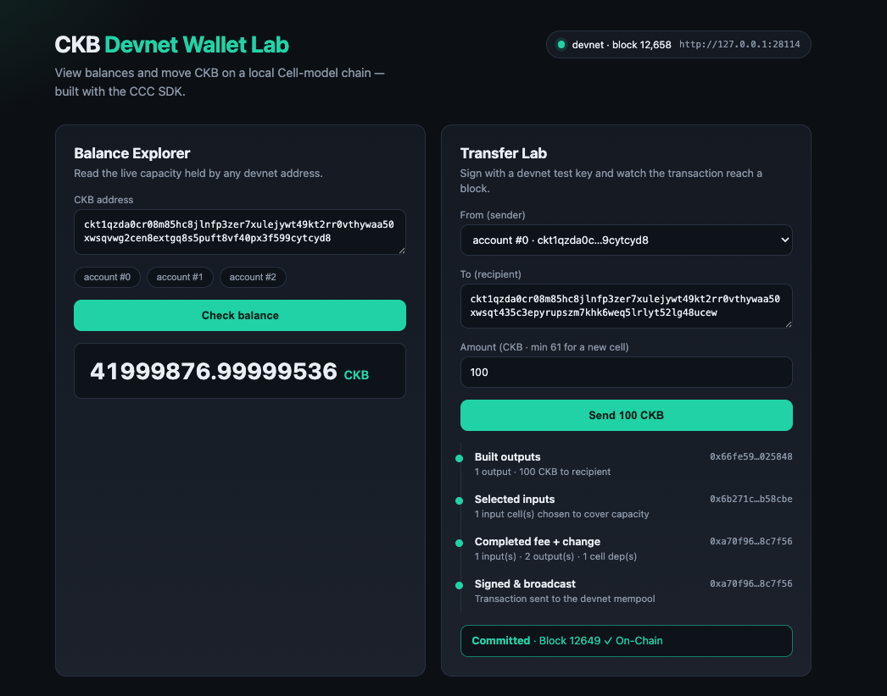
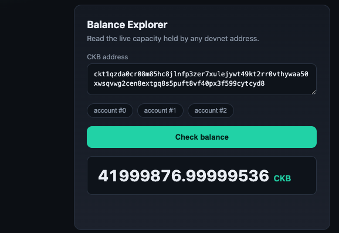
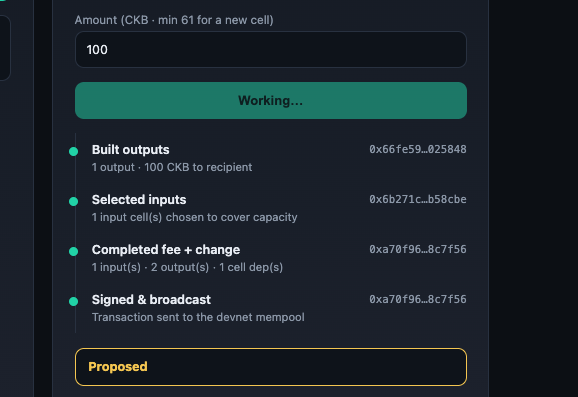
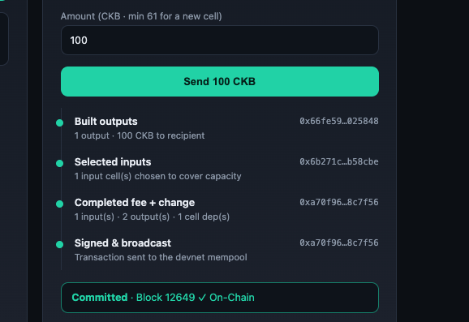

# Week 1 Report

**Week of:** 23–29 June 2026

## What I did this week

I set up a local CKB blockchain on my own machine and built a small web app on top
of it. The app does two simple things: it shows how much CKB an address holds, and
it lets me send CKB from one address to another. I got it working end to end and
watched a real transfer land in a block.

## What I learned

- On CKB there is no single "account balance". Your balance is just the total of
  the coins sitting in the cells your address owns. I had to add those up to show
  one number.
- Sending CKB means using up some of those cells and creating new ones — the
  receiver gets a new cell, and any leftover comes back to me as change.
- Getting a transaction ID back does **not** mean the transfer is done. It only
  means the network received it. I had to keep checking until the network said it
  was actually confirmed in a block.
- A local test chain needs a bit of manual setup to tell the app where its
  built-in pieces live. One piece was missing from the auto-generated config and I
  had to add it by hand before transfers would go through.

## What I built

[CKB Devnet Wallet Lab](../experiments/week-01/ckb-balance-transfer/) — a web app
to check any address' balance and send CKB on my local test chain. It also shows
each step of building a transfer and waits until the transfer is confirmed, so I
can see the whole process rather than just the end result.

## Evidence

| What it shows | Screenshot |
| --- | --- |
| The full app: balance on the left, a confirmed transfer on the right |  |
| Checking an address balance |  |
| The steps of building and sending a transfer |  |
| The transfer confirmed in a block |  |

## Challenges

The trickiest part was connecting the app to my local chain. The helper tool left
out one configuration piece, so my first transfers failed with a confusing error.
Once I added the missing piece, everything worked. I also kept it to local test
keys only, since putting a real private key in a web page would be unsafe.

## Next week

Keep building on this — store some data in a cell and try issuing a simple token.
